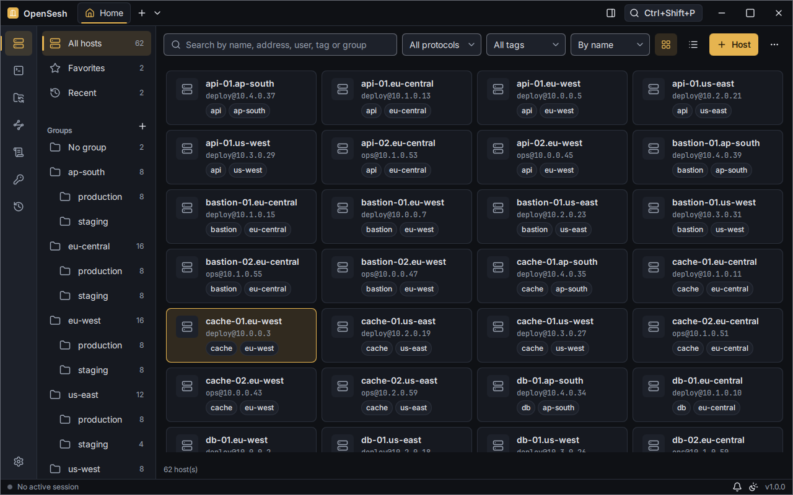
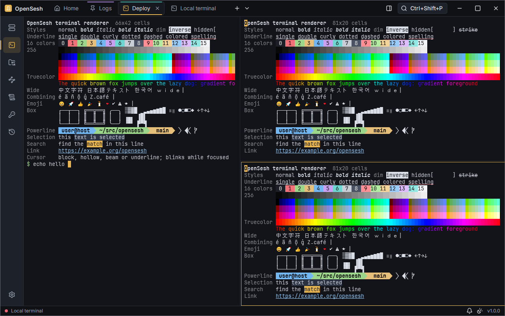
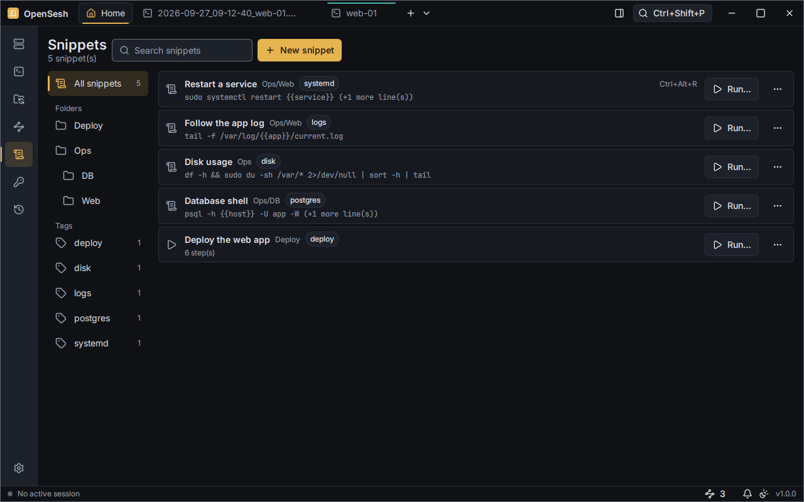
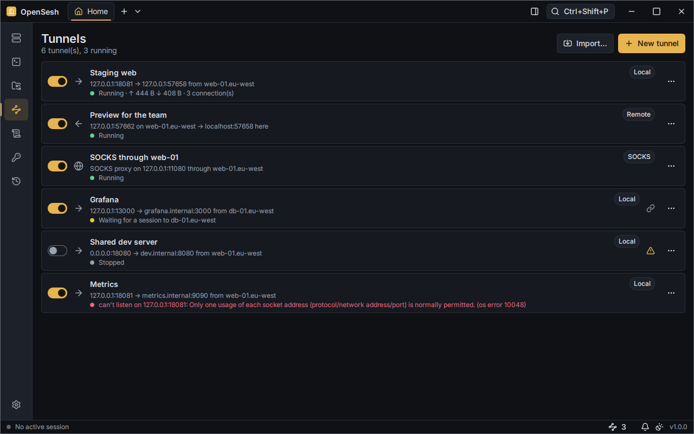
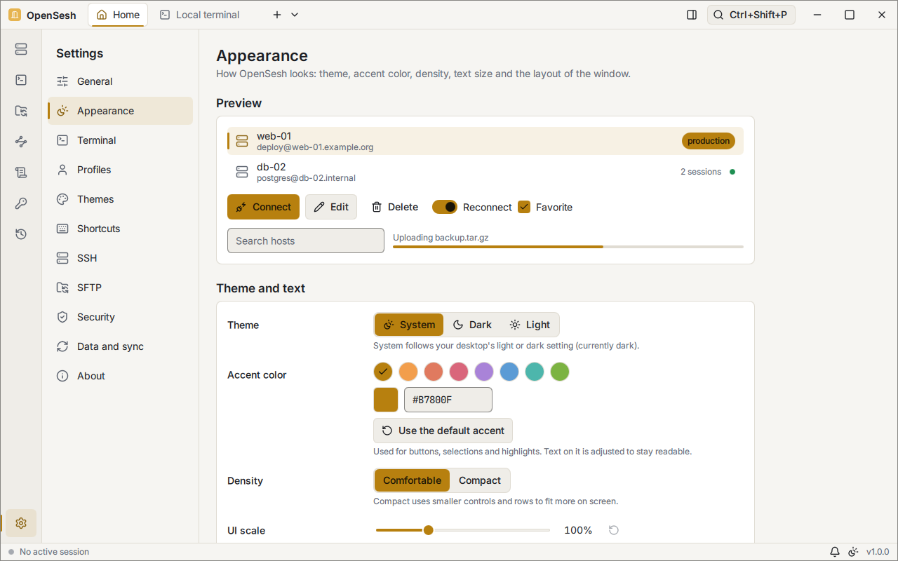

# OpenSesh

> *"Open sesame" for your servers.*

OpenSesh is an open source, cross-platform and lightweight remote connections client: local terminals, SSH, SFTP, S3, tunnels, serial, telnet, mosh, containers, RDP and VNC in a single native app built with **Rust** and **Qt 6 / QML** (through [cxx-qt](https://github.com/KDAB/cxx-qt)). No webviews, no Electron, and no telemetry.



| | |
|---|---|
|  |  |
|  |  |

## What it does

- **Terminals:** a fast GPU-drawn terminal for every shell the computer has (PowerShell, cmd, Git Bash, WSL, `/etc/shells`), with tabs that split into panes, move between windows and broadcast input, and layouts saved as workspaces. Profiles, themes (imported from other terminals), fonts, keyword highlighting and shortcuts are yours to change.
- **SSH** with a built-in client: host key checks, jump hosts, proxies, agents, one-time codes and reconnection, with its questions asked inside each pane (the system's OpenSSH stays available per host). X11 forwarding and Waypipe show remote graphical programs here ([guide](docs/remote-graphics.md)).
- **A keychain:** identities, passwords and SSH keys (generated, or imported from OpenSSH and PuTTY) in an encrypted vault, unlocked by the system keyring or a master password.
- **Files:** SFTP in a two-pane view and in a side panel that follows the terminal's folder, with a transfer queue that pauses and resumes, and server files edited in your own editor. S3 storage (AWS, MinIO, RustFS...) works the same way.
- **Tunnels:** local, remote and dynamic (SOCKS) forwards, on their own connection or with a host's sessions.
- **Snippets and macros** with variables and secrets, in one terminal or many at once; risky pastes shown for review first; sessions recorded and played back.
- **The server at a glance:** CPU, memory, network and disks of the connected server in the status bar, without installing anything there.
- **More protocols:** telnet, serial ports (with a hexadecimal view), mosh, Docker and Podman containers and Kubernetes pods, and remote desktops over RDP and VNC in tabs.
- **Your hosts, everywhere:** groups, tags, fuzzy search and quick connect; imports from `~/.ssh/config`, MobaXterm, PuTTY, Remmina and CSV; exports as bundles or OpenSSH config; settings synced between computers through Git or Syncthing, merged rather than overwritten ([guide](docs/sync.md)).

The **[user guide](docs/user-guide.md)** walks through all of it. Design decisions are in [`docs/adr/`](docs/adr/), sprint reports in [`docs/sprints/`](docs/sprints/), and the changes in [`CHANGELOG.md`](CHANGELOG.md).

## Install

### Linux

One command finds out which distribution you run, downloads the matching package of the latest release, checks it against the release's `SHA256SUMS.txt` and installs it with your package manager, which pulls in Qt:

```sh
curl -fsSL https://raw.githubusercontent.com/caixax/opensesh/main/install.sh | bash
```

| Distribution | Package |
|---|---|
| Debian 13 (trixie), Ubuntu 26.04 LTS | `.deb` (apt), one for each |
| Fedora | `.rpm` (dnf) |
| Arch Linux and derivatives (Manjaro, EndeavourOS, CachyOS) | `.pkg.tar.zst` (pacman) |

On a Wayland session the script also installs Qt's Wayland plugin. Saved passwords and keys use the desktop's keyring (GNOME Keyring, or KWallet with its Secret Service interface on); without one, set a master password in **Settings > Security**. Each `.deb` asks for the exact Qt of the release it was built on, so other Debian and Ubuntu releases (and their derivatives) need a [build from source](#building-from-source) for now.

For the AUR, `PKGBUILD`s for `opensesh` (built from the release's source) and `opensesh-git` (from this repository) are in [`packaging/aur/`](packaging/aur/) and in each release; they aren't published on the AUR yet.

Running the script again updates OpenSesh. It asks before installing anything; to pass options through the pipe, add them after `bash -s --`:

```sh
curl -fsSL https://raw.githubusercontent.com/caixax/opensesh/main/install.sh | bash -s -- --dry-run
```

| Option | What it does |
|---|---|
| `--version X.Y.Z` | Installs that release instead of the latest |
| `--yes` | Doesn't ask before installing |
| `--dry-run` | Shows what it would do, and does nothing |
| `--uninstall` | Removes OpenSesh (your settings in `~/.config/opensesh` stay) |

You can also download the package from the [releases page](https://github.com/caixax/opensesh/releases/latest) and install it yourself (`sudo apt install ./opensesh_*.deb`, `sudo dnf install ./opensesh-*.rpm` or `sudo pacman -U opensesh-*.pkg.tar.zst`).

### Windows 10 and 11

From the [releases page](https://github.com/caixax/opensesh/releases/latest):

- **Installer** (`OpenSesh-X.Y.Z-windows-x64-setup.exe`): installs for your user only, without administrator rights, and adds OpenSesh to the Start menu and to "Installed apps" for uninstalling.
- **Portable** (`OpenSesh-X.Y.Z-windows-x64-portable.zip`): unzip it anywhere and run `OpenSesh.exe`. Settings and data stay in the `data` folder next to it, so it runs from a USB stick.
- **[Scoop](https://scoop.sh):** the portable app, kept up to date by `scoop update`:
  ```powershell
  scoop install https://github.com/caixax/opensesh/releases/latest/download/opensesh.json
  ```

All of them bundle Qt, the Microsoft C++ runtime and a modern ConPTY, so nothing else is needed. Windows SmartScreen may warn the first time, since the builds aren't code-signed yet.

### Updates

OpenSesh never connects to the internet on its own. In **Settings > General > Updates** you can turn on a check for new releases (at startup and once a day) or check now:

- the installed Windows app downloads the new installer, verifies it against `SHA256SUMS.txt` and restarts updated;
- the portable app and the Linux packages open the download page (on Linux, running the install script again updates).

### Checking a download

Every release has a `SHA256SUMS.txt`. On Linux, in the folder with the download:

```sh
sha256sum --ignore-missing -c SHA256SUMS.txt
```

On Windows, compare the output of `Get-FileHash .\OpenSesh-*-setup.exe` (PowerShell) with the file's line.

### Command line

The packages also install `opensesh`, which works with the running OpenSesh (starting it when needed):

```sh
opensesh list [--json]                  # saved hosts, with the ones linked from ~/.ssh/config
opensesh connect web-01                 # connect to a saved host, by name or id
opensesh open deploy@10.0.1.21:2222     # quick connect (also ssh://, rdp://...); OpenSesh asks first
```

On Windows it is `bin\opensesh.exe` in the install or portable folder; add that `bin` folder to `PATH` to use it anywhere. Starting OpenSesh again while it runs brings the open window to the front instead of opening another one.

## Principles

- **Simple by default, powerful when you need it.**
- **Customizable down to the last terminal pixel:** fonts, colors, cursor, shortcuts, density and per-host profiles.
- **Keyboard first:** command palette and configurable shortcuts.
- **Native and light:** Qt Quick. No webviews and no Electron.
- **Local-first and private:** readable TOML files and secrets in an encrypted vault or the system keyring. **Zero telemetry.**
- **Wayland first:** built for Hyprland, Sway, KDE Plasma 6 and GNOME, plus X11 and Windows 10/11. See [`docs/testing/manual-matrix.md`](docs/testing/manual-matrix.md) for what has been verified so far.

## Building from source

You need Rust (the toolchain is pinned in `rust-toolchain.toml`), a C++17 compiler and **Qt 6.8 or newer**. See [`docs/dev-setup.md`](docs/dev-setup.md) for per-distro packages and Windows instructions.

```sh
cargo run -p opensesh-app
cargo xtask rdp      # the RDP helper next to the app (remote desktops)
```

## Releasing

A release starts from one command on a Windows machine:

```bat
scripts\release.bat -Patch        :: or -Minor, -Major, -V 1.2.0; add -InCi to build in GitHub Actions only
```

The script sets the version (of the app, the RDP helper and the lock files), moves the changelog's unreleased section under it, runs the tests, and tags the release. By default it also builds the Windows installer and portable zip, and the Linux packages in the machine's WSL distributions (Debian 13, Fedora and Arch), and publishes them, which takes minutes. The tag starts the **Release** workflow, which builds every package on GitHub's runners and **installs and starts each one on a clean system** (Debian 13, Ubuntu 26.04, Fedora, Arch and Windows, plus the AUR packages with `makepkg`). It then adds the checksums, the Scoop manifest and the winget and AUR manifests to the release, or publishes the whole release itself with `-InCi` ([ADR 0039](docs/adr/0039-release-pipeline.md)). Details are in [`docs/dev-setup.md`](docs/dev-setup.md#releasing).

## Contributing

See [`CONTRIBUTING.md`](CONTRIBUTING.md).

## License

OpenSesh is free software, licensed under the **GNU General Public License v3.0 or later** ([`LICENSE`](LICENSE)). Third-party assets keep their own licenses (see [`THIRD_PARTY_NOTICES.md`](THIRD_PARTY_NOTICES.md)).
